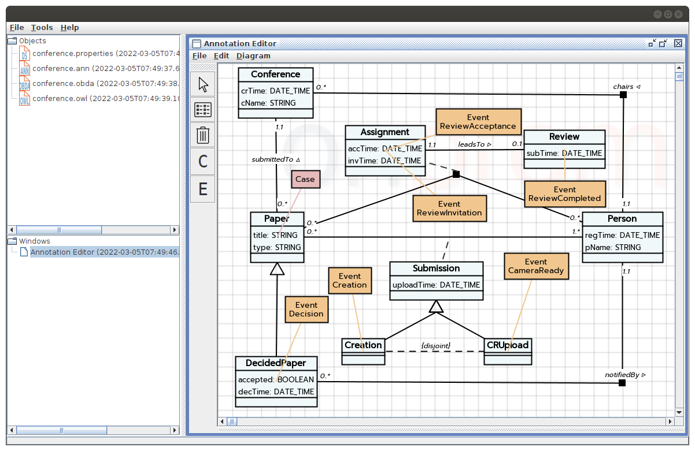
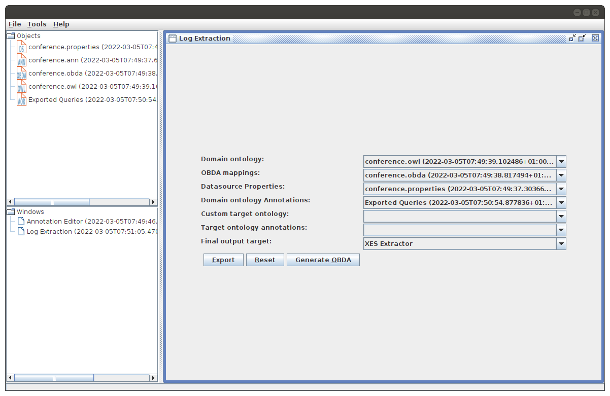
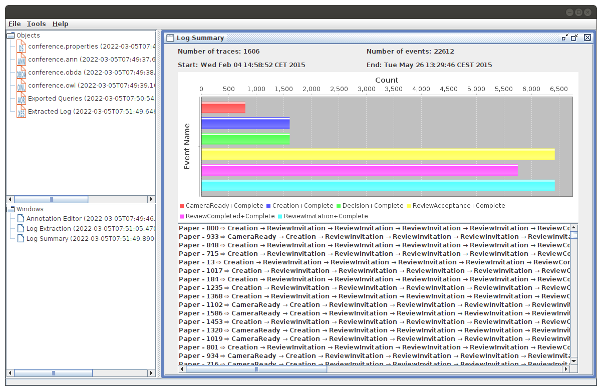
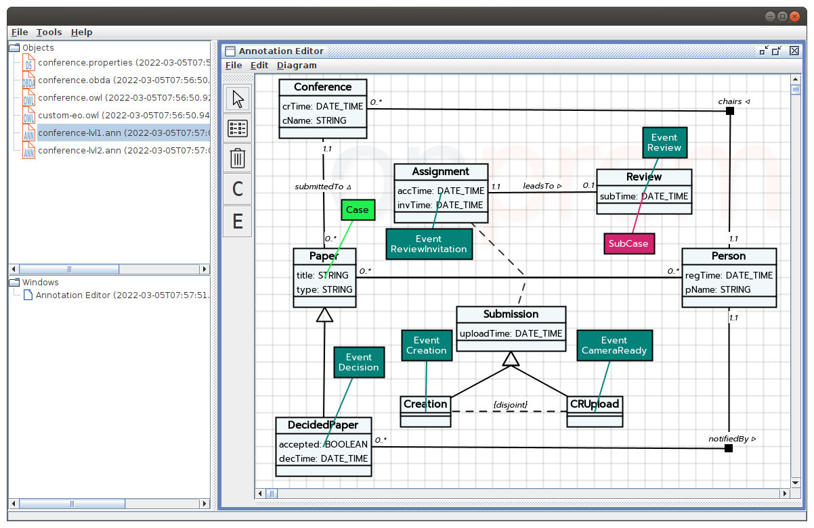
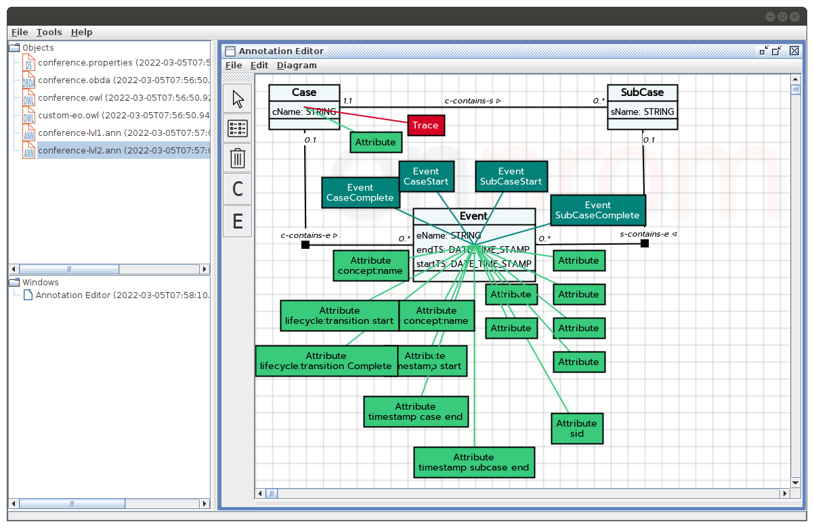
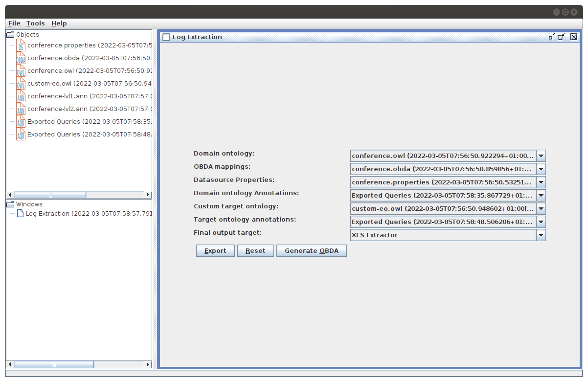
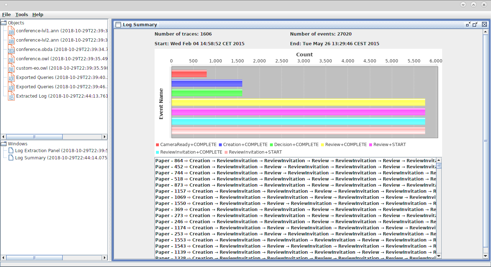

# HOW TO USE EXAMPLE

## Initialization

1. Start PostgreSQL database by one the following options:
  1. Start a Docker container with [Docker Compose](https://docs.docker.com/compose/)
     using [docker-compose.yml](./docker-compose.yml) file
  2. Restore the database in your database using [conference.sql.gz](./conference.sql.gz) file
2. Run onprom toolkit using the following command: `java -jar onprom-toolkit-2.0.jar` (you can also start
   from [onprom-toolkit](../onprom-toolkit) module)

## Extraction using Default XES Event Ontology

Follow the following steps for log extraction with default [XES event ontology](./default-eo.owl):

- Load [conference.properties](./conference.properties), [conference.obda](./conference.obda)
  , [conference.owl](./conference.owl), and [conference.ann](./conference.ann) files
- Double click on loaded `conference.ann` object and export queries in the annotation editor following `File -> Export`
  menu
- Select `Tools -> Export Log` to open log extraction window and select the following:
  - `conference.owl` for Domain ontology
  - `conference.obda` for OBDA mappings
  - `conference.properties` for Datasource properties
  - `Exported Queries` (from `conference.ann`) for Domain ontology annotations
- Click to `Export` button after selection

## Log extraction with custom event ontology

Follow the following steps for log extraction with custom [XES event ontology](./custom-eo.owl):

- Load [conference.properties](./conference.properties), [conference.obda](./conference.obda)
  , [conference.owl](./conference.owl)
  , [conference-lvl1.ann](./conference-lvl1.ann), [conference-lvl2.ann](./conference-lvl2.ann),
  and [custom-eo.owl](./custom-eo.owl) files
- Double click on loaded `conference-lvl1.ann` object and export queries in the annotation editor
  following `File -> Export` menu
- Double click on loaded `conference-lvl2.ann` object and export queries in the annotation editor
  following `File -> Export` menu
- Select `Tools -> Export Log` to open log extraction window and select the following:
  - `conference.owl` for Domain ontology
  - `conference.obda` for OBDA mappings
  - `conference.properties` for Datasource properties
  - `custom-eo.owl` for Custom target ontology
  - First `Exported Queries` (from `conference-lvl1.ann`) for Domain ontology annotations
  - Second `Exported Queries` (from `conference-lvl2.ann`) for Target ontology annotations
- Click to `Export` button after selection

